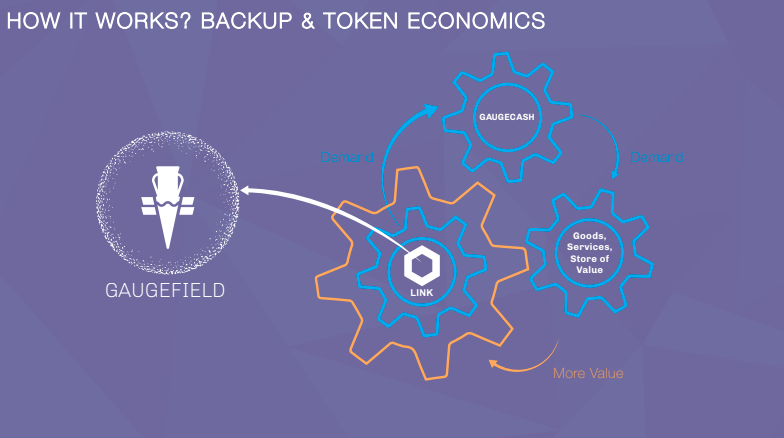

# Introducing GaugeCash, a decentralized peer-to-peer stable cash system based on Ethereum Blockchain.

## Problem:

In the last century-plus, there has been around thirty "Non-Domestic Currency Debt Crisis (typically inflationary deleve- ragings) "*, causing millions of people to lose their wealth and transactional value. Recent devaluation hits have occurred in Venezuela, Argentina, and Brazil. In 2020, due to the pandemic and the ina- bility of most Governments on how to move through, it will put in jeopardy citi- zens' store of value around the globe, AGAIN.

The Current stable cryptocurrency solutions have complex governance models and UI’s that reflect this complexity. This fact limits the adoption of the technology by new users that can benefit from it without having to be tech savvy.

The majority of the solutions rely heavily on traditional systems of value, exposing the holder of the asset to the risks of centralized finance, limiting their potential as a censorship proof store of value.

Centralized cryptocurrency exchanges complicate the process of accessing stable cryptocurrencies adding to the factors that seem to block mainstream
adoption.

## The solution : a decentralized stable cash system

We developed a monetary decentralized system (GAUs) based on the Blockchain Revolution Principles. Networked Integrity, Distributed Power, Value as Incentive, Security, Privacy, Rights Preserved, and Inclusion.

The price of the GAU is an index of world currencies that contains WorldWide Monetary Policy. We have backed up the value of the GAUs by the blockchain class in itself, taking advantage of its economic properties, making the solution truly decentralized and trustworthy.

To learn more please visit our [site](https://www.gaugecash.com/) or see the [WhitePapper](https://drive.google.com/file/d/192AGCZTuID3pjZQQAy9kh9oUHyHMDLS-/view).

## GaufeFiled: BACKUP TOKEN 

## Contact
If you have questions please send us an email at wacapital@whiteappleby.com or join our [Telegram Channel](https://t.me/GaugeCash)

## Disclaimer

This paper is for general information purposes only. It does not constitute investment advice or a recommendation or solicitation to buy or sell any investment and should not be used in the evaluation of the merits of making any investment decision. It should not be relied upon for accounting, legal or tax advice or investment recommendations. This paper reflects current opinions of the authors and is subject to change without being updated.
